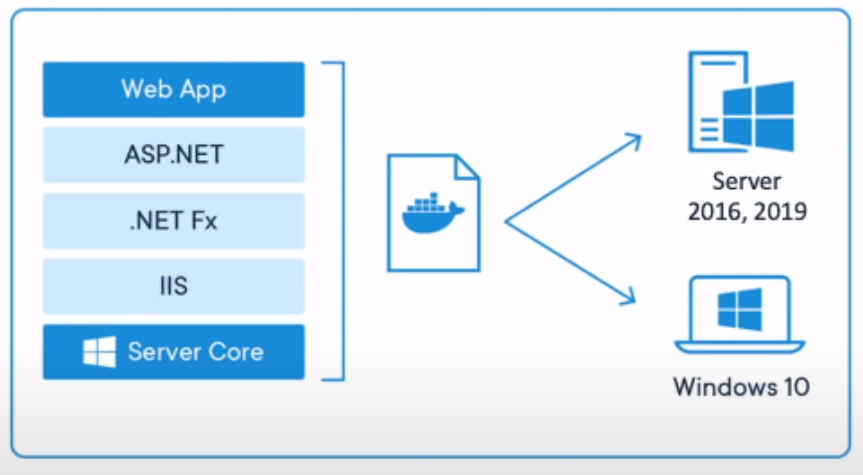

# Docker notes

## Table of Contents

- [Installation](#installation)
- [Docker image](#docker-image)
- [Installing an image](#docker-image)
- [Executing hello-world](#executing-hello-world)
- [Find an image from the command line](#find-an-image-from-the-command-line)
- [Installing an Ubuntu image](#installing-an-ubuntu-image)
- [Excecuting Ubuntu image](#excecuting-ubuntu-image)
- [Image execution](#image-execution)
- [Container concept](#container-concept)
- [Commands](#commands)
- [Nginx](#nginx)
- [Apache](#apache)
- [Mysql](#mysql)
- [Images](#images)
- [Volumes](#volumes)

## Installation

### Linux commands

```
sudo apt-get update

sudo apt-get install \
 ca-certificates \
 curl \
 gnupg \
 lsb-release

curl -fsSL https://download.docker.com/linux/ubuntu/gpg | sudo gpg --dearmor -o /usr/share/keyrings/docker-archive-keyring.gpg

echo \
  "deb [arch=$(dpkg --print-architecture) signed-by=/usr/share/keyrings/docker-archive-keyring.gpg] https://download.docker.com/linux/ubuntu \
  $(lsb_release -cs) stable" | sudo tee /etc/apt/sources.list.d/docker.list > /dev/null

sudo apt-get update
sudo apt-get install docker-ce docker-ce-cli containerd.io

sudo groupadd docker
sudo usermod -aG docker $USER
```

## Docker Image



- Is a template for create an environment.
- It contains all elements needed by your app (libs, env, config files, software, code, etc).
- It can have a version or snapshots based on time.
- It's immutable, but it can be cloned or shared.
- These images are created using a Dockerfile.

### Summary

- An image is like an installator that Docker provides to install the sofwtare we need in our container or workspace.
- An image contains all the elements necessary for my application to work in any environment.
- We could create versions of images in Docker.
- Dockerfile is a file that Docker uses to read a configuration, is like a step by step to make our application to work in any environment.

## Installing an image

**Docker images:** https://hub.docker.com/

## Executing hello-world

Excecute command

```
docker run hello-world
```

If the image is not installed docker will download the image from https://hub.docker.com/ then execute its content.

```
docker images: Provides a list of installed images.
```

An image can have multiple versions showed in TAG column.

## Find an image from the command line

```
docker search <image name>: Serach an image hosted on https://hub.docker.com/
```

## Installing an Ubuntu image

Install image command

```
docker pull ubuntu: Installs Ubuntu image.
```

It allow us to excecute ubuntu in this linux system, this is not a virtual machine, is ubuntu just for excecute a proccess.

## Excecuting Ubuntu image

```
docker run ubuntu echo "hello world": Run an Ubuntu image and execute "echo hello world" in its environment.

docker run -it ubuntu bash: "-it flag allows interactive excecution".
```

when we run `docker run -it ubuntu bash` a Bash Unix Shell will open for us running on an instance of ubuntu, this instance is called container, we are executing a program inside another program.

## Image execution

When we execute an image we are creating a container with its unique ID.

```
docker ps: Shows a register of container process with its unique ID.
```

## Container concept

- It's a running instance of an image.
- You can find a ton of images on docker.hub, (container repository).
- It achieve native system performance.
- There can be multiple containers in a single machine.

### Summary

- The run command executes processes from an image, those processes are called "Containers".
- From an image we run containers.
- We can run as many containers as the hardware supports.
- Each container has a unique ID.

## Commands

```
docker ps: Shows a list of containers that are executing.

docker ps -a: -a flag shows us a historical record of containers that have been executed

docker rm <id>: Eliminates a record of executed containers with id reference.

docker rm <name>: Eliminates a record of executed containers with name reference.

docker images: List installed images.

docker start <first 3 digits of id || id || name>: Start the execution of a previous container.

docker stop <first 3 digits of id || id || name>: Stop the execution of a previous container.

docker ps -aq: List ids of containers executed.

docker rm $(docker ps -aq): Removes all containers executed report.

docker stop $(docker ps -aq): Stop all containers in execution.

docker run -p 80:80 -p 3000:80 -p 4000:80 -p 5000:80 -d nginx: Executes all this nginx instances in one command executing in one container.

docker rm $(docker ps -aq) -f: The -f flag forces an action, in this case remove.

docker ps --format="ID\t{{.ID}}": Format the command's output.

docker ps --format="ID\t{{.ID}}\nName:\t{{.Names}}": Another example of formatting output.

nano ~/.bashrc{
  export DOCKER_FORMAT="ID\t{{.ID}}\nNAME\t{{.Names}}\nPORT\t{{.Ports}}\nStatus\t{{.Status}}\nCOMMAND\t{{.Command}}\nCREATED\t{{.CreatedAt}}\nSize\t{{.Size}}\n"
}: Creates a new environment variable to store a docker format output.

echo $DOCKER_FORMAT: Show environment variable

source ~/.bashrc: Loads the environment variables file.

docker ps --format=$DOCKER_FORMAT: Executes a docker formatted output from an environment variable.
```

For more information about formating visit: https://docs.docker.com/config/formatting/ and to see the different properties to format https://docs.docker.com/engine/reference/commandline/ps/

## Nginx

NGINX is open source software for web serving, reverse proxying, caching, load balancing, media streaming, and more. It started out as a web server designed for maximum performance and stability.

```
docker pull nginx: Installs nginx image.

docker run -p <container port>:<application port> nginx: The -p flag assigns a port to the container and binds that port to the application port, in order to create access to the application.

docker run -p <container port>:<application port> -d nginx: The -d flag means "detach", the container will execute in background.

docker run -d -p 80:80 -p 3000:80 --name <personalized name> nginx: The --name allow us to create a personalized name for container.
```

When we execute the Nginx container we are executing a server with an inner port inside a container. We have to assign a port to the container in order to use the inner server port.

We can run multiple nginx containers on different ports.

If we run this command docker run -p 80:80 -p 3000:80 -p 4000:80 -p 5000:80 -d nginx docker will only create one container instance serving to ports 80, 3000, 4000, 5000.

## Apache

Apache, an open-source Web server created by American software developer Robert McCool. As a Web server, Apache is responsible for accepting directory (HTTP) requests from Internet users and sending them their desired information in the form of files and Web pages.

```
docker run -p 80:80 -d httpd: Execute apache server, if the image doesn't exist, installs apache image from hub.docker.com.
```

## Mysql

```
docker run -d -p 3306:3306 --name mydatabase mysql: Installs and execute a mysql container with name reference "mydatabase".

docker run -d -p 3307:3306 --name mydatabase -e MYSQL_ROOT_PASSWORD=password mysql: The flag -e passes an environment variable in this case "MYSQL_ROOT_PASSWORD".
```

## Images

```
docker rmi <image name || image id>: Delete an image.
docker images -aq: Returns all intalled image ids.
docker rmi $(docker images -aq): Delete all images, if a container is executing from these images you must stop first the container execution.
```

## Volumes

```
docker run -d -p 80:80 --name website -v $(pwd):/usr/share/nginx/html:ro nginx: The flag ro means "read only" -v flag means volumes is used to copy local files to the container, any changes to the container will be reflected in the local file system.
```

## Connect to a container

```
docker exec -it website bash: Connect to a container, the flag -it means interactive mode, and bash means execute bash in interactive mode inside the container.
```

## Dockerfile

This file allows us to specify the instructions on how our container works, what image we want it to work on, what are the steps we want to be executed when the container or image is called, basically they are the instructions on how our project is going to be executed.

```
FROM nginx:latest

WORKDIR /usr/share/nginx/html

COPY . . : Copy the actual directory to the actual work directory
```

## Create an image

```
docker build -t testimage . : Create an image of the current directory.

docker build -t dacastanoz/website . : Creates an image prepared to be upload to my docker hub account.

docker login: Login to my docker account.

docker push dacastanoz/website: Upload an image to docker hub.
```

# Docker-compose

```
docker-compose up

docker-compose run web env

docker-compose stop

docker-compose down

docker-compose down --volumes

version: "3"

services:
  web:
    build: .
    ports:
      - "5000:5000"
    volumes:
      - c:/code
    environment: FLASK_ENV=development
  redis:
    image: "redis:alpine"

```
